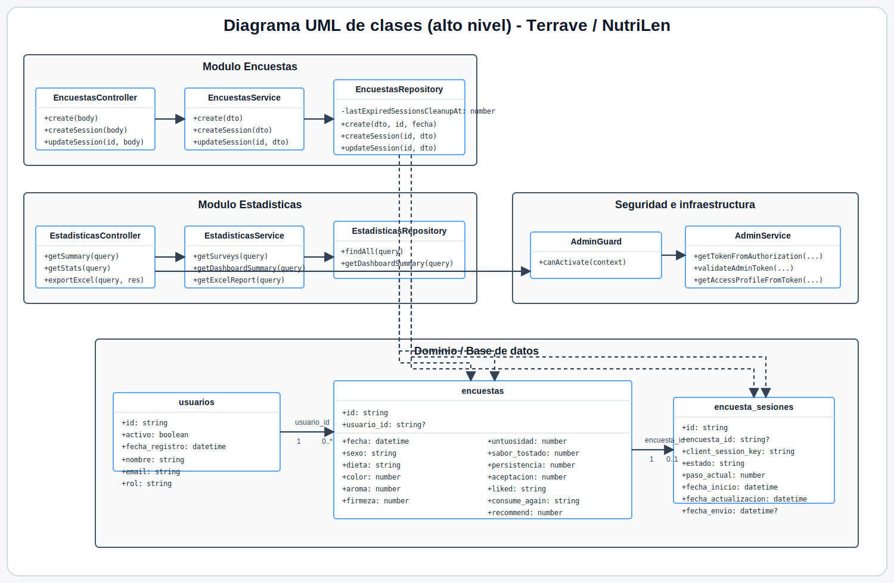

# TERRAVE

Plataforma web para evaluacion sensorial de medallones de lenteja, desarrollada como proyecto integrador entre Nutricion e Ingenieria en Sistemas de Informacion.

## Stack utilizado

<p align="left">
  
  
  
  
  
</p>
<p align="left">
  
  
  
  
  
</p>

## Sobre el proyecto

El sistema resuelve dos necesidades principales:

- Permitir que panelistas completen una encuesta sensorial publica, anonima y multi-step.
- Permitir que el equipo administrador consulte estadisticas, vea distribuciones, exporte resultados y supervise el estado general de las encuestas.

La solucion se divide en:

- `frontend/`: aplicacion Next.js para Home, Encuesta y Panel Administrador.
- `backend/`: API NestJS con reglas de negocio, seguridad, estadisticas y exportacion Excel.
- `database/`: esquema SQL y politicas recomendadas para la base de datos.
- `docs/`: documentacion tecnica, funcional, pruebas y evidencia complementaria.

## Diagrama UML de clases (alto nivel)

<p align="center">
  
</p>

Fuente editable del diagrama: [docs/diagrams/nutrilen-class-diagram.mmd](docs/diagrams/nutrilen-class-diagram.mmd). Para verlo mas grande, abri el SVG: [docs/diagrams/nutrilen-class-diagram-final.svg](docs/diagrams/nutrilen-class-diagram-final.svg).

## Requisitos previos

Antes de ejecutar el proyecto, asegurate de tener instalado:

- `Node.js 20` o superior
- `pnpm 10`
- `Python 3` para la exportacion Excel local del backend
- una base PostgreSQL compatible con el esquema del proyecto

## Instalacion

### 1. Clonar el repositorio

```bash
git clone <URL_DEL_REPOSITORIO>
cd NutriLen---EncuestaDeProducto
```

### 2. Instalar dependencias del frontend

```bash
cd frontend
pnpm install
```

### 3. Instalar dependencias del backend

```bash
cd ../backend
pnpm install
```

### 4. Preparar la base de datos

Orden sugerido:

1. aplicar `database/schema_supabase_backup.sql`
2. aplicar `database/rls_recommended_policies.sql` si corresponde
3. verificar que existan las tablas:
   - `usuarios`
   - `encuestas`
   - `encuesta_sesiones`

## Variables de entorno

### Frontend

Archivo de referencia:

- `frontend/.env.example`

Variables principales:

- `NEXT_PUBLIC_API_URL`
- `NEXT_PUBLIC_CLERK_PUBLISHABLE_KEY`
- `NEXT_PUBLIC_CLARITY_PROJECT_ID` opcional

### Backend

Archivo de referencia:

- `backend/.env.example`

Variables principales:

- `PORT`
- `DATABASE_URL`
- `CLERK_SECRET_KEY`

Variables recomendadas:

- `DB_SSL_REJECT_UNAUTHORIZED`
- `DB_POOL_MAX`
- `DB_IDLE_TIMEOUT_MS`
- `DB_CONNECTION_TIMEOUT_MS`
- `SLOW_REQUEST_THRESHOLD_MS`
- `SURVEY_IN_PROGRESS_WINDOW_MINUTES`
- `SURVEY_SESSION_CLEANUP_INTERVAL_MS`
- `EXCEL_PYTHON_EXPORT_URL`
- `EXCEL_EXPORT_INTERNAL_TOKEN`
- `VERCEL_PROTECTION_BYPASS`

## Como levantar el proyecto

### Backend

```bash
cd backend
pnpm dev
```

### Frontend

```bash
cd frontend
pnpm dev
```

Por defecto:

- frontend: `http://127.0.0.1:3001`
- backend: segun `PORT`, normalmente `http://127.0.0.1:3000`

## Rutas principales

- `/` home del producto
- `/encuesta` flujo de encuesta publica
- `/administrador` panel administrativo

## Endpoints principales del backend

- `GET /api/v1/health`
- `GET /api/v1/health/live`
- `GET /api/v1/health/ready`
- `POST /api/v1/encuestas/sesiones`
- `PATCH /api/v1/encuestas/sesiones/:id`
- `POST /api/v1/encuestas`
- `GET /api/v1/admin/me`
- `GET /api/v1/estadisticas/resumen`
- `GET /api/v1/estadisticas`
- `GET /api/v1/estadisticas/excel`

## Testing y validaciones

### Frontend

```bash
cd frontend
pnpm lint
pnpm test
pnpm test:coverage
pnpm build
pnpm test:e2e
pnpm test:e2e:report
```

### Backend

```bash
cd backend
pnpm lint
pnpm test
pnpm test:coverage
pnpm build
pnpm perf:routes
pnpm perf:concurrency
pnpm test:security
```

## Que cubren las pruebas

- `Vitest`: pruebas unitarias y de componentes.
- `React Testing Library`: comportamiento visual controlado.
- `Playwright`: flujos completos del encuestado y del administrador.
- `Lighthouse CI`: auditorias de performance y accesibilidad en frontend.

Documentacion relacionada:

- [docs/testing.md](docs/testing.md)
- [docs/pruebas-software-preparadas.md](docs/pruebas-software-preparadas.md)
- [docs/rnf-01-rnf-02-rnf-03-validacion.md](docs/rnf-01-rnf-02-rnf-03-validacion.md)

## Observabilidad

### Microsoft Clarity

El frontend esta preparado para usar Microsoft Clarity desde:

- `frontend/src/app/layout.tsx`

Se activa solo si existe:

```env
NEXT_PUBLIC_CLARITY_PROJECT_ID=tu_project_id
```

Si la variable esta vacia:

- no se carga el script
- no afecta el diseno
- no afecta la suite E2E

### Lighthouse CI

Configuracion principal:

- `frontend/lighthouserc.json`
- `.github/workflows/ci-frontend.yml`

Audita:

- `/`
- `/encuesta`
- `/administrador`

## CI del repositorio

### Frontend

Workflow:

- `.github/workflows/ci-frontend.yml`

Valida:

- `pnpm lint`
- `pnpm test`
- `pnpm test:coverage`
- `pnpm build`
- `pnpm test:e2e`

Publica artefactos de:

- coverage
- Playwright report

### Backend

Workflow:

- `.github/workflows/ci-backend.yml`

Valida:

- `pnpm lint`
- `pnpm test`
- `pnpm test:coverage`
- `pnpm build`

Publica artefactos de:

- coverage
- build del backend

## Documentacion realizada durante el desarrollo del proyecto

- [docs/DOCUMENTACION_TECNICA_FUNCIONAL_NUTRILEN.md](docs/DOCUMENTACION_TECNICA_FUNCIONAL_NUTRILEN.md)
- [docs/despliegue-vercel-supabase.md](docs/despliegue-vercel-supabase.md)
- [docs/testing.md](docs/testing.md)
- [docs/HISTORIAL_TECNICO_V1.md](docs/HISTORIAL_TECNICO_V1.md)
- [docs/cierre-y-plan-versionado.md](docs/cierre-y-plan-versionado.md)
